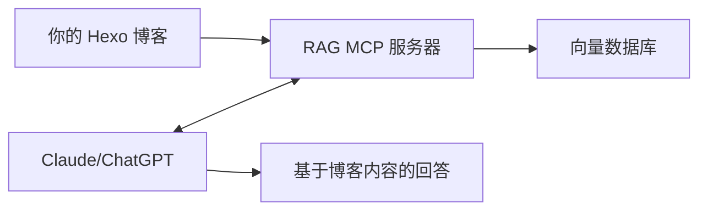

# hexo-blog-rag-mcp

中文 | [English](./README_EN.md)

基于向量搜索的 Hexo 博客 RAG (检索增强生成) MCP 服务器。

> 💡 **快速体验：** 如果你想添加 [David's 博客](https://luoluoqinghuan.cn) 的 MCP，可通过 https://luoluoqinghuan.cn/mcp 添加。

## 🚀 快速开始

### Docker 快速部署

使用官方镜像，一键启动：

```bash
docker run -d \
  -p 3000:3000 \
  -e HEXO_SOURCE_DIR=/data/blog \
  -e EMBEDDING_TYPE=simple \
  -v /path/to/your/hexo/blog/source/_posts:/data/blog \
  ghcr.io/richdavidmu/hexo-blog-rag-mcp:latest
```

**镜像地址：** `ghcr.io/richdavidmu/hexo-blog-rag-mcp:latest`

替换 `/path/to/your/hexo/blog/source/_posts` 为你的 Hexo 博客 `source/_posts` 目录的实际路径即可。

---

**将你的 Hexo 博客转化为 LLM 的专属知识库。**

本项目通过 MCP (Model Context Protocol) 协议，让大语言模型能够直接访问和搜索你的 Hexo 博客内容。当你与 Claude、ChatGPT 等 AI 助手对话时，它们可以实时检索你博客中的技术文章、学习笔记、经验总结等内容，为你提供基于个人知识库的精准回答。

### 🎯 核心价值

- **📚 知识复用**：多年积累的博客文章不再沉睡，成为 AI 助手的知识来源
- **🎓 个性化回答**：AI 基于你的技术栈和经验给出定制化建议
- **⚡ 即时检索**：无需手动翻阅旧文章，AI 自动找到相关内容
- **🔒 隐私可控**：数据存储在本地，完全掌控你的知识库

### 💡 使用场景

- **技术问答**：询问 AI 关于你博客主题的问题，获取基于你文章的回答
- **知识回顾**：快速查找曾经写过的技术方案和解决方法
- **学习助手**：让 AI 结合你的学习笔记提供个性化的学习建议
- **内容创作**：基于已有文章内容，辅助创作新的博客文章

### 🔗 如何工作



1. **索引阶段**：扫描你的 Hexo 博客，将文章内容转换为向量并存储
2. **对话阶段**：当你向 AI 提问时，服务器检索相关文章片段
3. **增强回答**：AI 基于检索到的内容，结合上下文给出精准回答

## 功能特性

- 🔍 基于向量的 Hexo 博客语义搜索
- 🤖 多种 Embedding 模型支持（Simple、OpenAI、Qwen）
- 📊 基于文件哈希的增量索引
- 👀 实时文件监听，自动更新索引
- 📝 JSON 格式的结构化日志
- 🎯 搜索相似度阈值过滤
- 🔧 可自定义工具描述，精准控制 AI 调用场景

## 环境变量配置

### 必需配置

| 变量名            | 说明                    | 示例                 |
| ----------------- | ----------------------- | -------------------- |
| `HEXO_SOURCE_DIR` | Hexo 博客源文件目录路径 | `/path/to/hexo/blog` |
| `DB_DIR`          | LanceDB 向量数据库目录  | `./data`             |
| `MCP_NAME`        | MCP 服务器名称          | `hexo-blog-rag`      |

### Embedding 模型配置

选择以下三种 Embedding 方法之一：

#### 1. Simple Embedding（默认）

无需额外配置，使用基于哈希的简单向量化方法。

```bash
EMBEDDING_TYPE=simple
```

#### 2. OpenAI Embedding

```bash
EMBEDDING_TYPE=openai
OPENAI_API_KEY=sk-xxxxxxxxxxxxx
OPENAI_EMBEDDING_MODEL=text-embedding-3-small  # Optional, default: text-embedding-3-small
OPENAI_BASE_URL=https://api.openai.com/v1      # Optional, for custom endpoints
```

**Supported models:**

- `text-embedding-3-small` (1536 dimensions)
- `text-embedding-3-large` (3072 dimensions)
- `text-embedding-ada-002` (1536 dimensions)

#### 3. Qwen Embedding

```bash
EMBEDDING_TYPE=qwen
QWEN_API_KEY=sk-xxxxxxxxxxxxx
QWEN_EMBEDDING_MODEL=text-embedding-v3         # Optional, default: text-embedding-v3
QWEN_BASE_URL=https://dashscope.aliyuncs.com/compatible-mode/v1  # Optional
```

**Supported models:**

- `text-embedding-v3` (1024 dimensions)
- `text-embedding-v2` (1536 dimensions)

### Tool Description Configuration

自定义工具描述，引导 AI 助手在特定场景下调用工具：

| Variable                            | Description                   | Default                                                                                                                                              |
| ----------------------------------- | ----------------------------- | ---------------------------------------------------------------------------------------------------------------------------------------------------- |
| `TOOL_SEARCH_BLOG_DESCRIPTION`      | `search_blog` 工具的描述      | `在 Hexo 博客中搜索相关内容。该博客主要涵盖 JavaScript、前端开发、React 和大语言模型(LLM)相关技术内容。仅当用户询问这些主题相关的问题时使用此工具。` |
| `TOOL_GET_BLOG_CONTEXT_DESCRIPTION` | `get_blog_context` 工具的描述 | `获取博客内容用于回答问题。该博客专注于 JavaScript、前端开发、React 和 LLM 技术。仅在用户提问涉及这些技术领域时调用。`                               |

**使用场景示例**：

如果你的博客专注于特定领域（如前端、AI、区块链等），可以通过自定义工具描述来限制 AI 助手只在相关主题下调用搜索工具，避免在无关问题上浪费调用：

```bash
# 示例：限定为前端技术博客
TOOL_SEARCH_BLOG_DESCRIPTION="在前端技术博客中搜索内容。该博客涵盖 React、Vue、TypeScript、前端工程化等主题。仅在用户询问前端相关技术问题时使用。"

# 示例：限定为 AI/ML 博客
TOOL_SEARCH_BLOG_DESCRIPTION="在 AI 和机器学习博客中搜索。涵盖深度学习、LLM、提示工程、模型微调等内容。仅在 AI/ML 相关问题时调用。"

# 示例：通用博客（不限制）
TOOL_SEARCH_BLOG_DESCRIPTION="在博客中搜索相关内容。"
```

### 可选配置

| 变量名      | 说明                                | 默认值        |
| ----------- | ----------------------------------- | ------------- |
| `NODE_ENV`  | 运行环境模式                        | `development` |
| `LOG_LEVEL` | 日志级别 (error, warn, info, debug) | `info`        |

## 安装

```bash
# 安装依赖
pnpm install

# 构建项目
pnpm run build
```

## 使用方法

### 开发环境

```bash
# 创建 .env 文件
cp .env.example .env

# 编辑 .env 配置你的环境变量
# 然后启动服务器
pnpm run dev
```

### 生产环境

```bash
# 构建项目
pnpm run build

# 启动服务器
pnpm run start
```

### Docker 部署

```bash
# 构建镜像
docker build -t hexo-blog-rag-mcp .

# 运行容器
docker run -d \
  -p 3000:3000 \
  -e HEXO_SOURCE_DIR=/data/blog \
  -e EMBEDDING_TYPE=openai \
  -e OPENAI_API_KEY=sk-xxxxx \
  -v /path/to/hexo/blog:/data/blog \
  hexo-blog-rag-mcp
```

## MCP 工具

### `search_blog`

在 Hexo 博客中搜索相关内容。

**参数：**

- `query` (string, 必需): 搜索查询
- `topK` (number, 可选): 返回结果数量（默认: 5）
- `threshold` (number, 可选): 相似度阈值（默认: 1.0）

**示例：**

```json
{
  "query": "如何部署 Hexo",
  "topK": 3,
  "threshold": 0.8
}
```

### `get_blog_context`

获取博客内容用于回答问题。

**参数：**

- `question` (string, 必需): 用户问题
- `threshold` (number, 可选): 相似度阈值（默认: 1.0）

**示例：**

```json
{
  "question": "优化 Hexo 博客性能的最佳方法是什么？",
  "threshold": 0.7
}
```

## MCP Resources

### `blog://all-posts`

获取所有博客文章列表。

**返回格式：** JSON，包含文章总数和文章标题列表。

### `blog://posts/{title}`

获取指定文章的完整内容。

**参数：**

- `title`: 文章标题（Markdown 文件名，不含 .md 扩展名）

**返回格式：** 文章的完整 Markdown 内容。

## 日志

日志存储在 `logs/` 目录中：

- `app-YYYY-MM-DD.log` - 应用日志
- `error-YYYY-MM-DD.log` - 错误日志

日志按天轮转，保留 14 天。

## 工作原理

### 增量索引

系统使用 MD5 哈希值追踪文档变化：

1. 启动时计算每个 Markdown 文件的哈希值
2. 与数据库中存储的哈希值比较
3. 仅重新索引发生变化的文件
4. 自动从索引中删除已删除的文件

### 文件监听

实时监控博客目录的变化：

- **文件新增**：自动索引新文章
- **文件修改**：删除旧的 chunks 并重新索引
- **文件删除**：从向量数据库中移除

### 智能工具调用

通过自定义工具描述，实现：

1. **智能判断** - AI 在回答问题前判断是否需要搜索博客
2. **减少无效调用** - 对于与博客主题无关的问题（如天气、新闻等），不会调用搜索工具
3. **提高效率** - 只在相关主题下才搜索博客内容，节省 API 调用和响应时间

**示例：**

- ❌ "今天天气怎么样？" - AI 不会调用博客搜索
- ❌ "帮我写一首诗" - AI 不会调用博客搜索
- ✅ "React 中如何使用 useEffect？" - AI 会调用博客搜索
- ✅ "LLM 的提示工程有什么技巧？" - AI 会调用博客搜索

## 项目架构

```
hexo-blog-rag-mcp/
├── packages/rag-mcp-server/
│   ├── src/
│   │   ├── services/
│   │   │   └── embedding.ts       # Embedding 服务 (Simple/OpenAI/Qwen)
│   │   ├── storage/
│   │   │   └── vector-store.ts    # 向量数据库操作
│   │   ├── loaders/
│   │   │   └── hexo-loader.ts     # Hexo Markdown 文件加载器
│   │   ├── utils/
│   │   │   ├── logger.ts          # Winston 日志
│   │   │   ├── splitter.ts        # 文本分割
│   │   │   └── env.ts             # 环境变量
│   │   ├── mcp-server.ts          # MCP 服务器核心
│   │   └── index.ts               # 应用入口
│   └── logs/                      # 日志文件
└── .env                           # 配置文件
```

## 许可证

Apache-2.0

## 贡献

欢迎贡献！请随时提交 Pull Request。

## 支持

如果遇到问题或有疑问，请[提交 issue](https://github.com/yourusername/hexo-blog-rag-mcp/issues)。
