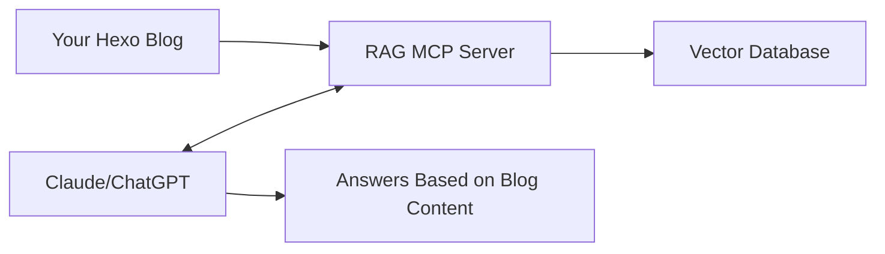

# hexo-blog-rag-mcp

[中文](./README.md) | English

A RAG (Retrieval-Augmented Generation) MCP server for Hexo blog with vector search capabilities.

> 💡 **Quick Demo:** If you want to add [David's Blog](https://luoluoqinghuan.cn) MCP, you can add it via https://luoluoqinghuan.cn/mcp

**Transform your Hexo blog into a dedicated knowledge base for LLMs.**

This project enables Large Language Models to directly access and search your Hexo blog content through the MCP (Model Context Protocol). When you chat with AI assistants like Claude or ChatGPT, they can retrieve relevant content from your technical articles, learning notes, and experience summaries in real-time, providing accurate answers based on your personal knowledge base.

### 🎯 Core Value

- **📚 Knowledge Reuse**: Your accumulated blog posts become a living knowledge source for AI assistants
- **🎓 Personalized Answers**: AI provides customized advice based on your tech stack and experience
- **⚡ Instant Retrieval**: No need to manually search old articles - AI finds relevant content automatically
- **🔒 Privacy Control**: Data stored locally, you have full control over your knowledge base

### 💡 Use Cases

- **Technical Q&A**: Ask AI questions about your blog topics and get answers based on your articles
- **Knowledge Review**: Quickly find technical solutions and methods you've written about before
- **Learning Assistant**: Get personalized learning suggestions based on your study notes
- **Content Creation**: Use existing article content to assist in creating new blog posts

### 🔗 How It Works



1. **Indexing Phase**: Scans your Hexo blog, converts article content into vectors and stores them
2. **Conversation Phase**: When you ask AI a question, the server retrieves relevant article snippets
3. **Enhanced Answers**: AI provides accurate answers based on retrieved content combined with context

## Features

- 🔍 Vector-based semantic search for Hexo blog posts
- 🤖 Multiple embedding model support (Simple, OpenAI, Qwen)
- 📊 Incremental indexing based on file hash
- 👀 Real-time file watching for automatic updates
- 📝 JSON-based structured logging
- 🎯 Search threshold filtering
- 🔧 Customizable tool descriptions for targeted AI interactions

## Environment Variables

### Required

| Variable          | Description                        | Example              |
| ----------------- | ---------------------------------- | -------------------- |
| `HEXO_SOURCE_DIR` | Path to Hexo blog source directory | `/path/to/hexo/blog` |
| `DB_DIR`          | LanceDB vector database directory  | `./data`             |
| `MCP_NAME`        | MCP server name                    | `hexo-blog-rag`      |

### Embedding Configuration

Choose one of the following embedding methods:

#### 1. Simple Embedding (Default)

No additional configuration needed. Uses a hash-based vectorization method.

```bash
EMBEDDING_TYPE=simple
```

#### 2. OpenAI Embedding

```bash
EMBEDDING_TYPE=openai
OPENAI_API_KEY=sk-xxxxxxxxxxxxx
OPENAI_EMBEDDING_MODEL=text-embedding-3-small  # Optional, default: text-embedding-3-small
OPENAI_BASE_URL=https://api.openai.com/v1      # Optional, for custom endpoints
```

**Supported models:**

- `text-embedding-3-small` (1536 dimensions)
- `text-embedding-3-large` (3072 dimensions)
- `text-embedding-ada-002` (1536 dimensions)

#### 3. Qwen Embedding

```bash
EMBEDDING_TYPE=qwen
QWEN_API_KEY=sk-xxxxxxxxxxxxx
QWEN_EMBEDDING_MODEL=text-embedding-v3         # Optional, default: text-embedding-v3
QWEN_BASE_URL=https://dashscope.aliyuncs.com/compatible-mode/v1  # Optional
```

**Supported models:**

- `text-embedding-v3` (1024 dimensions)
- `text-embedding-v2` (1536 dimensions)

### Tool Description Configuration

Customize tool descriptions to guide AI assistants in specific scenarios:

| Variable                            | Description                             | Default                                                                                                                                                                                                                                 |
| ----------------------------------- | --------------------------------------- | --------------------------------------------------------------------------------------------------------------------------------------------------------------------------------------------------------------------------------------- |
| `TOOL_SEARCH_BLOG_DESCRIPTION`      | Description for `search_blog` tool      | `Search relevant content in Hexo blog. This blog mainly covers JavaScript, frontend development, React and Large Language Models (LLM) related technical content. Use this tool only when users ask questions related to these topics.` |
| `TOOL_GET_BLOG_CONTEXT_DESCRIPTION` | Description for `get_blog_context` tool | `Get blog content to answer questions. This blog focuses on JavaScript, frontend development, React and LLM technologies. Call only when user questions involve these technical fields.`                                                |

**Usage Examples:**

If your blog focuses on specific domains (frontend, AI, blockchain, etc.), you can customize tool descriptions to limit AI assistant calls to relevant topics only, avoiding wasted calls on unrelated questions:

```bash
# Example: Frontend technology blog
TOOL_SEARCH_BLOG_DESCRIPTION="Search content in frontend technology blog. Covers React, Vue, TypeScript, frontend engineering, etc. Use only for frontend-related technical questions."

# Example: AI/ML blog
TOOL_SEARCH_BLOG_DESCRIPTION="Search in AI and machine learning blog. Covers deep learning, LLM, prompt engineering, model fine-tuning, etc. Call only for AI/ML related questions."

# Example: General blog (no restrictions)
TOOL_SEARCH_BLOG_DESCRIPTION="Search relevant content in the blog."
```

### Optional

| Variable    | Description                              | Default       |
| ----------- | ---------------------------------------- | ------------- |
| `NODE_ENV`  | Environment mode                         | `development` |
| `LOG_LEVEL` | Logging level (error, warn, info, debug) | `info`        |

## Installation

```bash
# Install dependencies
pnpm install

# Build the project
pnpm run build
```

## Usage

### Development

```bash
# Create .env file
cp .env.example .env

# Edit .env with your configuration
# Then start the server
pnpm run dev
```

### Production

```bash
# Build the project
pnpm run build

# Start the server
pnpm run start
```

### Docker

```bash
# Build image
docker build -t hexo-blog-rag-mcp .

# Run container
docker run -d \
  -p 3000:3000 \
  -e HEXO_SOURCE_DIR=/data/blog \
  -e EMBEDDING_TYPE=openai \
  -e OPENAI_API_KEY=sk-xxxxx \
  -v /path/to/hexo/blog:/data/blog \
  hexo-blog-rag-mcp
```

## MCP Tools

### `search_blog`

Search for relevant content in the Hexo blog.

**Parameters:**

- `query` (string, required): Search query
- `topK` (number, optional): Number of results to return (default: 5)
- `threshold` (number, optional): Similarity threshold (default: 1.0)

**Example:**

```json
{
  "query": "How to deploy Hexo",
  "topK": 3,
  "threshold": 0.8
}
```

### `get_blog_context`

Get blog content relevant to a question.

**Parameters:**

- `question` (string, required): User question
- `threshold` (number, optional): Similarity threshold (default: 1.0)

**Example:**

```json
{
  "question": "What is the best way to optimize Hexo blog performance?",
  "threshold": 0.7
}
```

## MCP Resources

### `blog://all-posts`

Get a list of all blog posts.

**Returns:** JSON format containing total count and post titles.

### `blog://posts/{title}`

Get the complete content of a specific blog post.

**Parameters:**

- `title`: Post title (filename without .md extension)

**Returns:** Full Markdown content of the post.

## Logs

Logs are stored in the `logs/` directory:

- `app-YYYY-MM-DD.log` - Application logs
- `error-YYYY-MM-DD.log` - Error logs

Logs are rotated daily and kept for 14 days.

## How It Works

### Incremental Indexing

The system uses MD5 hash to track document changes:

1. On startup, calculates hash for each Markdown file
2. Compares with stored hashes in database
3. Only re-indexes files that have changed
4. Automatically removes deleted files from index

### File Watching

Monitors the blog directory for real-time updates:

- **File added**: Automatically indexes new post
- **File modified**: Removes old chunks and re-indexes
- **File deleted**: Removes from vector database

### Smart Tool Calling

By customizing tool descriptions, you can:

1. **Intelligent Judgment** - AI decides whether to search blog before answering
2. **Reduce Invalid Calls** - Avoids calling search for unrelated topics (weather, news, etc.)
3. **Improve Efficiency** - Only searches when relevant, saving API calls and response time

**Examples:**

- ❌ "What's the weather today?" - AI won't call blog search
- ❌ "Write me a poem" - AI won't call blog search
- ✅ "How to use useEffect in React?" - AI will call blog search
- ✅ "What are LLM prompt engineering tips?" - AI will call blog search

## Architecture

```
hexo-blog-rag-mcp/
├── packages/rag-mcp-server/
│   ├── src/
│   │   ├── services/
│   │   │   └── embedding.ts       # Embedding service (Simple/OpenAI/Qwen)
│   │   ├── storage/
│   │   │   └── vector-store.ts    # Vector database operations
│   │   ├── loaders/
│   │   │   └── hexo-loader.ts     # Hexo Markdown file loader
│   │   ├── utils/
│   │   │   ├── logger.ts          # Winston logger
│   │   │   ├── splitter.ts        # Text chunking
│   │   │   └── env.ts             # Environment variables
│   │   ├── mcp-server.ts          # MCP server core
│   │   └── index.ts               # Application entry
│   └── logs/                      # Log files
└── .env                           # Configuration
```

## License

Apache-2.0

## Contributing

Contributions are welcome! Please feel free to submit a Pull Request.

## Support

If you encounter any issues or have questions, please [open an issue](https://github.com/yourusername/hexo-blog-rag-mcp/issues).
